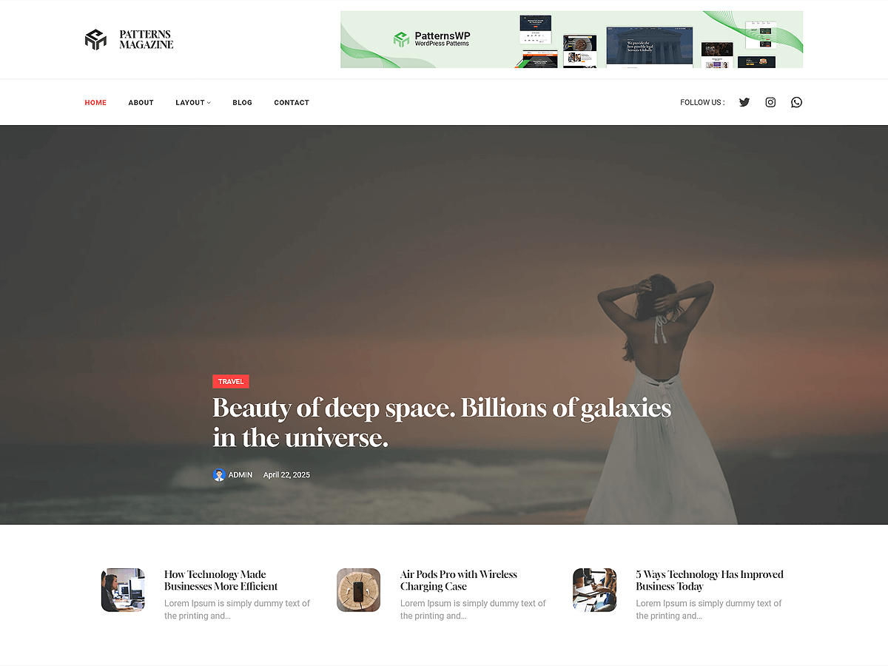

# Patterns Magazine

Patterns Magazine is a sleek and versatile WordPress theme designed for online magazines, news portals, and editorial sites. Built with Full Site Editing (FSE), this theme enables easy customization of headers, footers, templates, and global styles directly in the WordPress Site Editor.With pre-designed layouts, it’s perfect for showcasing articles, breaking news, opinion pieces, multimedia content, and author highlights. The theme includes layouts for homepage, categories, trending stories, editor’s picks, team, subscription forms, contact pages, and more. Its responsive design ensures your website looks polished across all devices, providing a seamless and engaging experience for your readers.

Primary color: `#f44`.



## Features

- 3 hero and landing patterns
- 2 card layouts (card-1 through card-2)
- 9 posts-layout variations (posts-layout-1 through posts-layout-9)
- 5 archive/post-listing patterns
- Contact page pattern (page-contact)
- 1 menu navigation pattern
- 11 section layout patterns (featured sections and section titles)
- Full Site Editing (FSE) support
- Responsive design
- 68 block patterns + 15 templates + 11 template parts
- Editorial-focused layouts for content-heavy sites

## Requirements

- WordPress 6.6 or higher
- PHP 7.0 or higher
- Tested up to WordPress 6.7

## Development

This theme uses `@wordpress/scripts`:

```sh
npm install
npm run start    # dev mode with watch
npm run build    # production build
```

## License

GNU General Public License v2 or later.

This theme is based on [WP Block Theme Boilerplate](https://github.com/codersantosh/wp-block-theme-boilerplate), (C) 2025 Santosh Kunwar, [GPLv2 or later](https://www.gnu.org/licenses/gpl-2.0.html).
